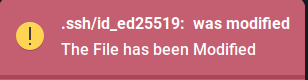

# File and Directory Tracker Daemon

This program tracks changes made to a specified file(s)/directories and sends notifications when certain events occur. It runs as a "daemon" on Unix systems.

## Features

- Monitors file access, deletion, modification, and write/close events.
- Sends desktop notifications using `libnotify` when significant file events are detected.
- Runs as a background, allowing continuous monitoring of file/directory changes.

## Installation

1. Clone the repository or download the source code.

```
git clone https://github.com/kingbian/track-it.git
```

## Compile

1. Compile the program using:

```
gcc -o track_it `pkg-config --cflags --libs libnotify`  trackIt.c
```

- `libnotify is required`

2. Copy the executable to your systems PATH to make it accessible system wide

```
sudo cp track_it /usr/local/bin
```

## Usage

#### To start the program as a background process

```
track_it /path/to/file /path/to/directory &
```

#### To end the program

```
kill track_it
```

## Screen shots

  

## Dependencies

- `libnotify` used for desktop notifications

## Acknowledgments

- This project was inspired by:

```
https://github.com/sinasun/count-it
```
